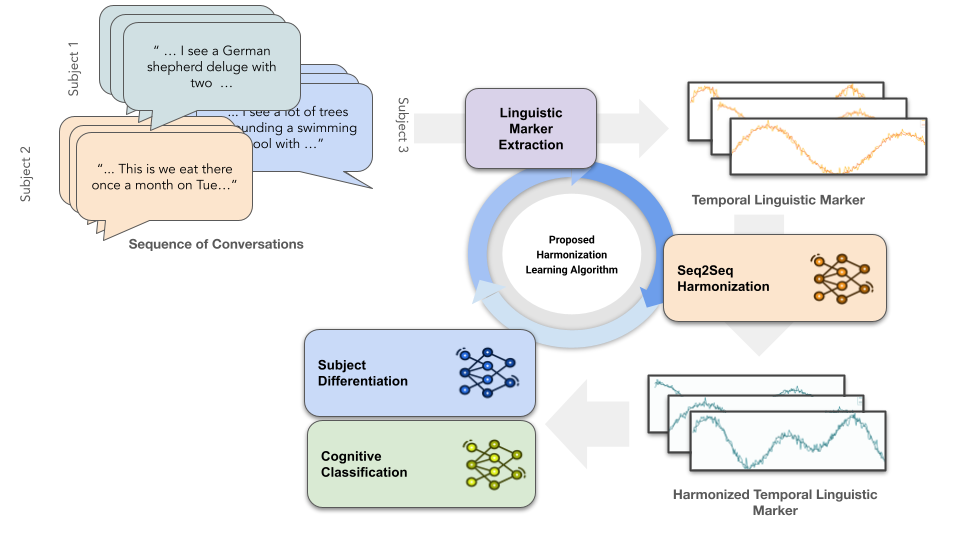

## Temporal Harmonization: Improved Detection of Mild Cognitive Impairment from Temporal Language Markers using Subject-invariant Learning
Official code for paper: "Temporal Harmonization: Improved Detection of Mild Cognitive Impairment from Temporal Language Markers using Subject-invariant Learning", Bao Hoang, Siqi Liang, Yijiang Pang, Hiroko H. Dodge, and Jiayu Zhou, AMIA 2025 (submitted).

## Overview 

 

Mild Cognitive Impairment (MCI) is an early stage of dementia characterized by cognitive decline and behavioral changes. Early detection is crucial for timely interventions, improved clinical trial cohort selection, and the development of targeted therapies. Linguistic markers have recently emerged as a non-invasive, cost-effective method for MCI detection. This study analyzes linguistic markers from conversations between participants and healthcare professionals to distinguish MCI from cognitively normal (NL) individuals. The dynamics of multiple conversations of a subject carry fine-granular linguistic change over time and expect to greatly enhance detection accuracy. However, individual variations in speaking styles pose challenges for learning cognitive characteristics from temporal sequences of conversations. To address this, we propose a temporal harmonization method to mitigate distributional differences in linguistic features across subjects, improving model generalization. Our results show that machine learning models leveraging subject-invariant harmonized temporal features greatly improve the prediction performance of MCI detection from multiple conversations.

## Package dependencies
Use `conda env create -f environment.yml` to create a conda env and activate by `conda activate temporal-harmonization`.

## Language Marker Extractor
To extract language marker from the transcripts, you need to extract syntactic complexity features using [L2 Syntactic Complexity Analyzer](https://sites.psu.edu/xxl13/l2sca/). We can also use GUI from [neosca GitHub Repo](https://github.com/tanloong/neosca) to extract syntatic features.

After that, put your syntactic complexity feature in file `rawdata/syntactic_complexity_measures.csv` and your transcripts data in folder `Transcriptions`, then run command ```python feature_extractor.py```

It will give you 99-dimensional language marker feature in `rawdata/id2feature.p`

## Temporal Methods
Here we provide several demos of using harminzation commands. Remember to use your own transcripts data in Transcriptions folder, the existing data in repo is just for demo.

- **None Harmonization:**

    - No Temporal Language Markers (Majority Voting): ```python main.py --solver Standard_solver```
    - Temporal Language Markers: ```python main.py --solver temporal_solver``` 

- **Generalized least squares:**
  
    - Run ```python main.py --solver Baseline_confounder_solver```
 
- **Subject Harmonization ([Paper](https://pubmed.ncbi.nlm.nih.gov/38160279/)):**
  
    - Run ```python main.py --solver subject_harmonization_solver```

- **Temporal Harmonization (Proposed Method):**
    - Run ```python main.py --solver temporal_sequence_harmonization_adversarial_solver```

We also provide options to reproduce the same experiments from the paper: MaskTest, Coefficients, Main, FeatureImportance
- **Sequence Length**:
    - Run ```python main.py --experiment MaskTest```
- **Loss weighting factors**:
    - Run ```python main.py --experiment Coefficients```
- **Feature Importance**:
    - Run ```python main.py --experiment FeatureImportance```
    
The AuxiliaryExperiments folder also contains scripts for subject differentiation and confounder classification performance, both before and after temporal harmonization.

## Data Request
The data is available upon request at [https://www.i-conect.org/](https://www.i-conect.org/)

## Acknowledgement